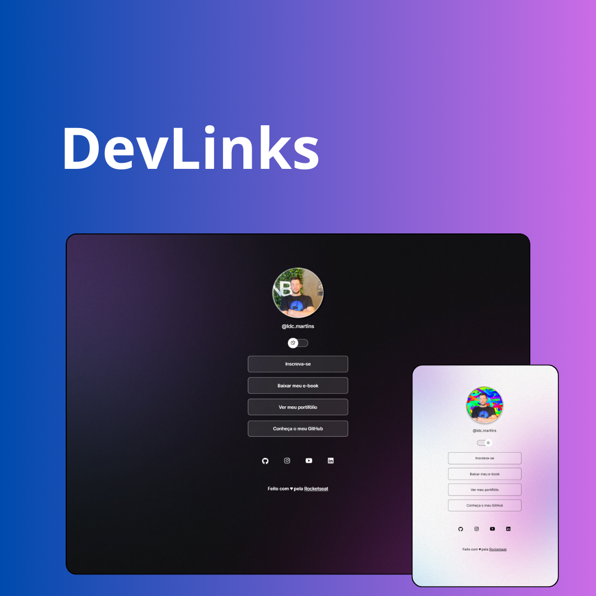

<h1 align="center"> DevLinks  </h1>

Evento exclusivo e gratuito, promovido pela Rocketseat para ensino de tecnologias WEB.

  <a href="#-tecnologias">Tecnologias</a>&nbsp;&nbsp;&nbsp;|&nbsp;&nbsp;&nbsp;
  <a href="#-projeto">Projeto</a>&nbsp;&nbsp;&nbsp;|&nbsp;&nbsp;&nbsp;
  <a href="#-layout">Layout</a>&nbsp;&nbsp;&nbsp;|&nbsp;&nbsp;&nbsp;
  <a href="#memo-licença">Licença</a>

  

 

  

## 🚀 Tecnologias

Esse projeto foi desenvolvido com as seguintes tecnologias:

- HTML e CSS
- JavaScript
- Figma
- Git e Github

## 💻 Projeto

O DevLinks é um agregador de links para usar como cartão de visitas online.

## 🎓 Aprendizado

Esse foi o meu primeiro projeto utilizando HTML, CSS e um pouco de JavaScript.

Foi bem desafiador e me trouxe muitos aprendizados. Um ponto que achei muito bacana foi a questão de estilização do CSS. É incrível e por meio dele eu consigo estruturar uma página WEB do meu jeitinho. Achei fantástico!

Outro ponto muito bacana foi a questão do JavaScript. A linguagem abre muitas ações executáveis, muito bacana. 

Vou continuar estudando e me dedicando para aprender e melhorar cada vez mais! 

## 🔖 Layout

Você pode visualizar o layout do projeto através [DESSE LINK](https://www.figma.com/file/J1Z33MISC22YZB8wfxiIns/NLW-Copa-Explorer/duplicate). É necessário ter conta no [Figma](https://figma.com) para acessá-lo.

## :memo: Licença

Esse projeto está sob a licença MIT.

---

Feito com ♥ by Rocketseat :wave: [Participe da nossa comunidade!](https://discord.gg/rocketseat)